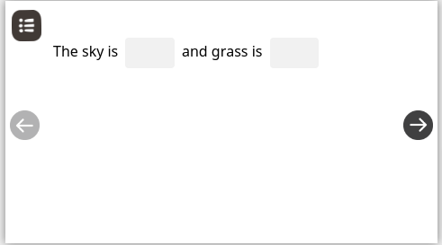
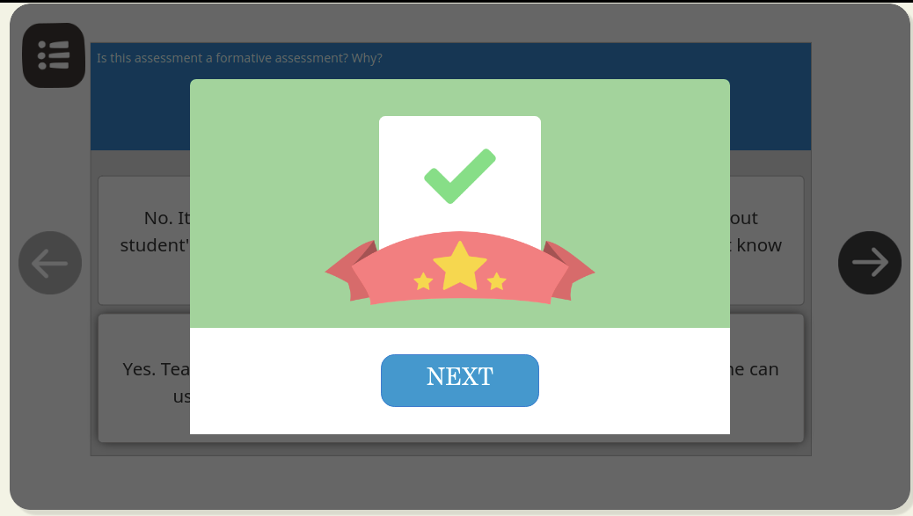

# Quiz

[Interactive editor](../../../../../../use/installation-guide/editors/interactive-editor.md) is responsible to creation of assessment assets. Content player v1 is capable to play the assessment type asset which is written in [Ekstep content markup language](./)

## Types of quiz

* [MCQ](quiz.md#mcq)
* [MTF](quiz.md#mtf)
* [FTB](quiz.md#ftb)
* [Reordering words](quiz.md#reordering-words)
* [Arrange in Sequence](quiz.md#arrange-in-sequence)

There are following types of assessment can be taken in [ECML player v1](./).

### MCQ

Using v1 player you can render the Multiple choice Question type assets. In this type of questions user has to select the correct options.

To create the MCQ type questions, please refer [interactive editor](../../../../editors/editor/features.md#mcq) MCQ feature section.

&#x20;As image showing bellow, you can create the same MCQ question with different types of layouts.

.gif>)

### MTF

MTF is the short form of 'Match the following' questions. v1 player is capable to play the MTF type quiz. This capability provide user to drag and drop the options within a canvas area and also provide the capability to calculate the partial score.

To create the MTF type questions, please refer [interactive editor MTF](../../../../editors/editor/features.md#mtf) feature section.

### FTB&#x20;

FTB is stands for 'Fill in the blank' type questions. In this type of question v1 player is capable to show the partial score if some of the answer is correct.

To create the FTB type questions, please refer [interactive editor FTB ](../../../../editors/editor/features.md#ftb)feature section.



### Reordering words

This type of questions provide user the capability to drag and drop the options within a canvas area to order and reorder the words&#x20;

To create the Reordering words type questions, please refer [interactive editor reordering words ](../../../../editors/editor/features.md#reordering-words)feature section.

.gif>)

### Arrange in Sequence

In a content player v1 you can render the arrange in sequence type questions.

To create the Arrange in Sequence type questions, please refer [interactive editor Arrange in Sequence](../../../../editors/editor/features.md#arrange-in-sequence) feature section.

.gif>)

## Configurations

### Editor

Please refer [Configuring Questions](http://docs.sunbird.org/1.8/features-documentation/questionset\_create/#configuring-questions) section in sunbird developer documents to configure the quiz from editor side.

### Player

Content player v1 is capable to renderer all above mentioned and this can be configure by using the following configuration.

<details>

<summary><strong>Question Minimum Font Size</strong></summary>

What should be the the minimum font size can be render in content player v1 defines by the _questionMinFontSize_ property.

```
{
    questionMinFontSize: '1.285em'
}
```

####

</details>

<details>

<summary>Show submit</summary>

Show submit property present the show button on end page, which will show after attempting the assessment. This is a configurable property of [overlay config](../../content-player-v1.md#overlay) of content player v1.


Sample config to show submit button.

```
overlay: {
    showSubmit: false
}
```

</details>

### Quiz

Please refer [Compiling Question Set](http://docs.sunbird.org/1.8/features-documentation/questionset\_create/#compiling-question-set) section in sunbird developer documents to configure the quiz.

The following things can be configure to render the quiz.

<details>

<summary>Show Immediate Feedback</summary>

After every question rendered, the ECML player v1 will show the following immediate feedback popup.

#### Correct answer

If the answer is correct, evaluation popup will show the correct icon popup and next button to go to the next question



#### Wrong answer

If the answer is wrong, evaluation popup will show the wrong icon popup with next and try again button.


#### Partial score

The partial score can be calculate for [MTF](quiz.md#mtf) and [FTB](quiz.md#ftb) type questions


</details>

<details>

<summary>Display</summary>

This takes the reference to show the number of question in one question set.

</details>

<details>

<summary>Shuffle Questions</summary>

By using this option you can shuffle the questions while rendering the quiz. So that, the random questions will come at the time of the attempting the question set.&#x20;

</details>

<details>

<summary>Max Score</summary>

If we have the 10 questions in one question set and we set the Max score the property 10, the max score will divide into the 10 questions.

</details>

## End Page

After rendering the quiz, the content player v1 is capable to show the final score on the end page of the asset. Please refer [end page section](../../content-player-v1.md#end-page) for more information.
